# Aplicativo gerencial do ecommerce Justice League
Projeto final realizado para a disciplina de react native da Residência de Software Serratec.

# Funcionalidades utilizadas
<ul>
  <li>Dark mode</li>
  <li>Login</li>
  <li>Search bar</li>
  <li>Tratamento de erros</li>
  <li>Splash Screen</li>
  <li>Tab e Stack navigation</li>
  <li>Modais</li>
</ul>

# Caso queira ver nosso aplicativo rodando
<p>Nós utilizamos como tela base um Pixel 2 com 5' de tela.</p>
<p>Nossa API esta hospedada no Heroku por isso talvez demore um pouco para carregar na primeira utilização.</p>

<p>Lembre-se de utilziar o seguinte comando no terminal caso queira executar o projeto.</p>

```
npm install
```

# Planejamento do trabalho

https://www.figma.com/file/gTuakrcynhKDJGLZEBRLrY/Mobile-Justice-League?node-id=1%3A3

# Screenshots do aplicativo
<div>
  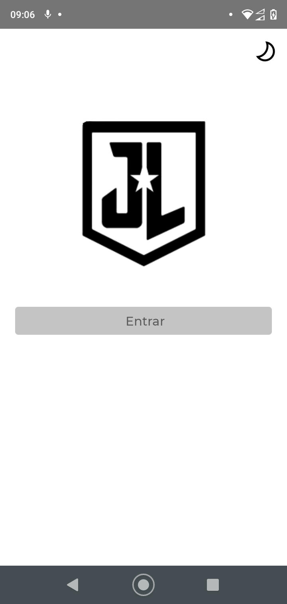
  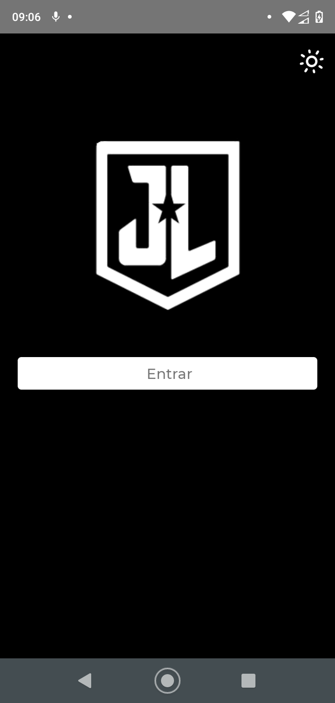
  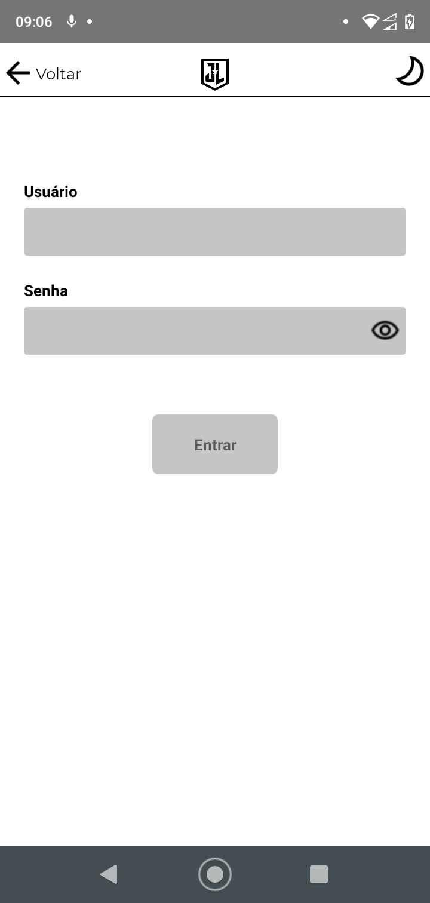
  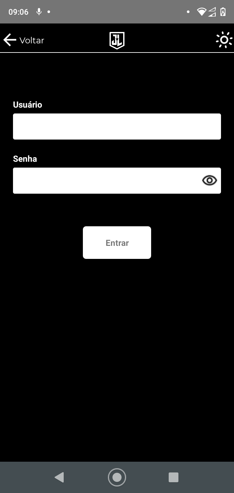
  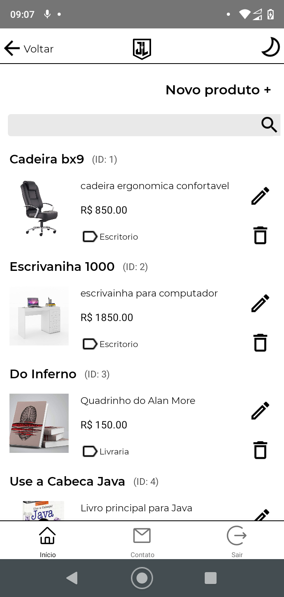
  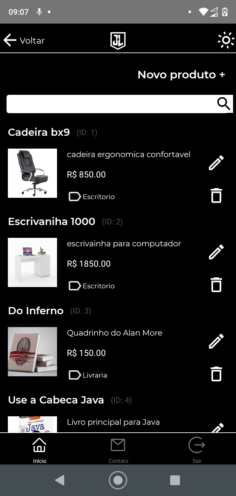
  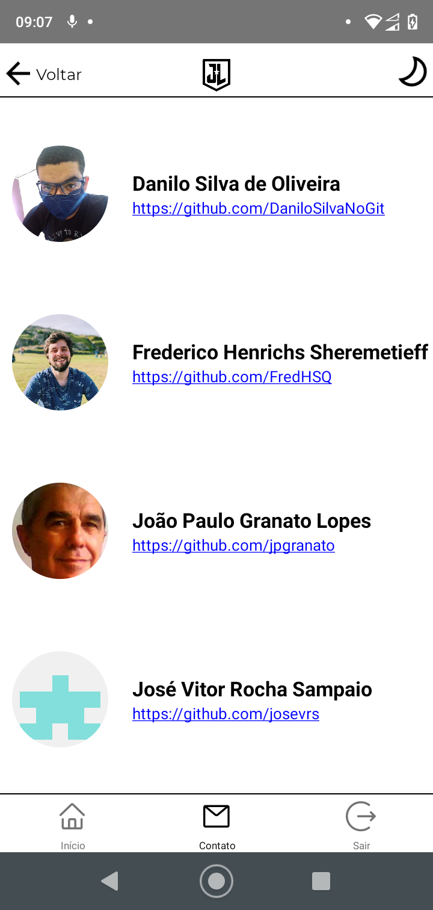
  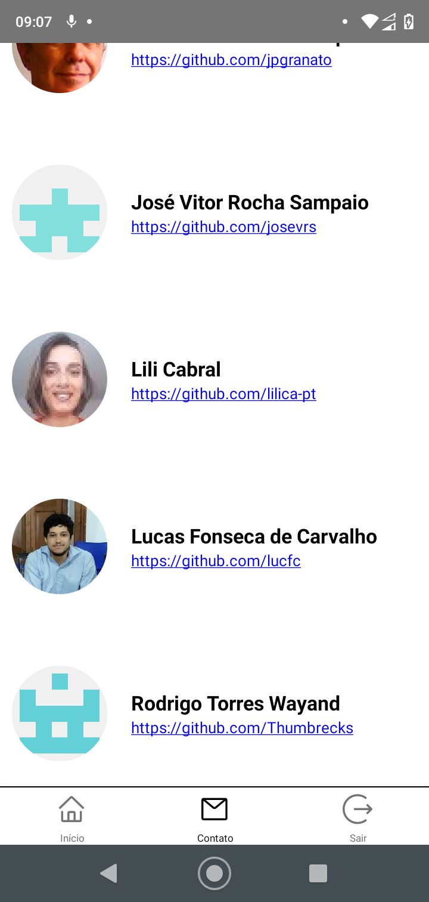
  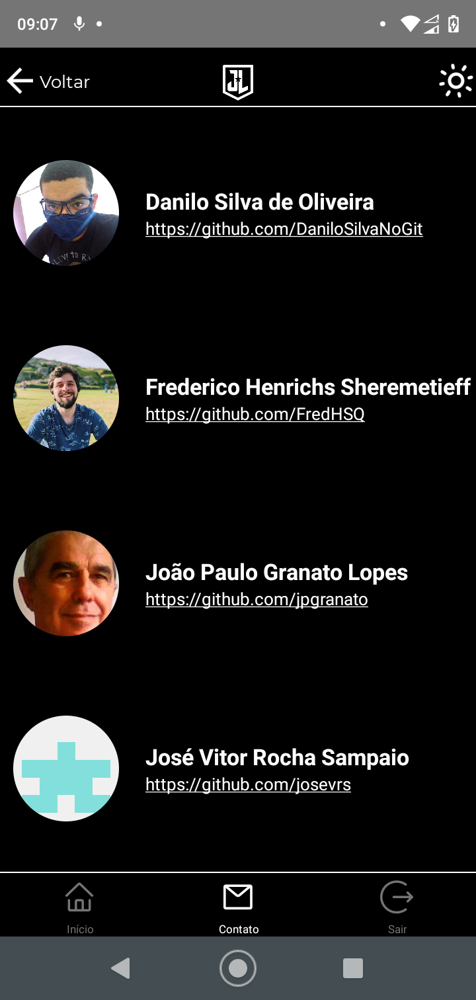
  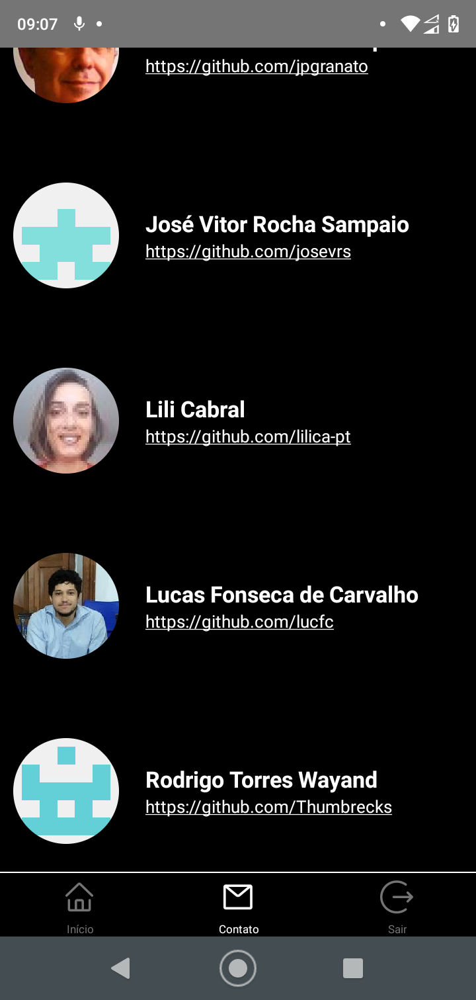
  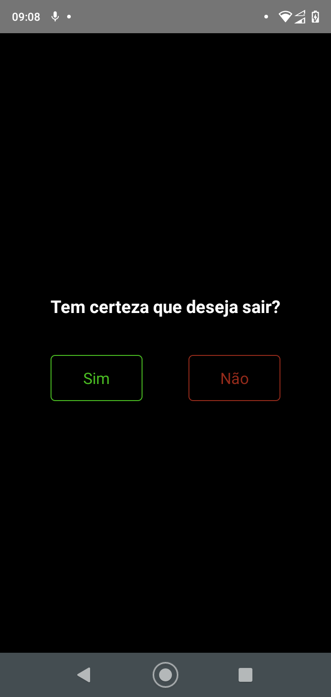
</div>
